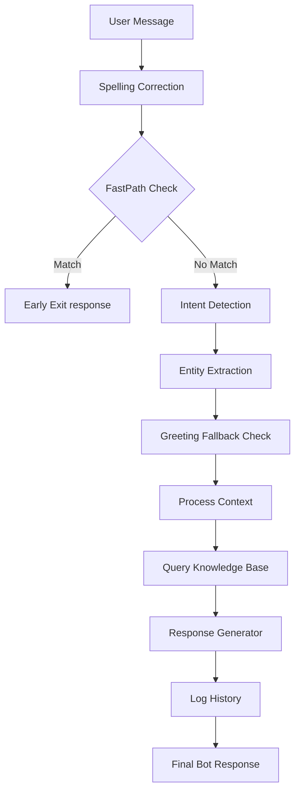

# Loan Origination System (LOS) Chatbot Study Guide

Welcome to the **Loan Origination System (LOS) Chatbot Study Guide**! This document explains how our educational chatbot was converted from a generic business assistant into a dedicated loan assistant while preserving the exact modular pipes-and-filters architecture from Modules 1–8.

---

## 1. Pipeline Execution Flow Overview

When a user submits a message, it flows sequentially through the following pipeline:

### Pipeline Details:
1. **Spelling Correction**: Cleans up input typos (e.g., `morinnig` -> `morning`, `coost` -> `cost`) using `search_engine.correct_spelling`.
2. **FastPath**: Checks for simple greetings or gibberish. If matched, exits early without running full processing.
3. **Intent Detection**: Classifies user goal using rule-based keywords. Added new `loan_application` intent.
4. **Entity Extraction**: Regex-based extraction of data (Name, PAN, Aadhaar, Income, Employer, Loan Type, etc.).
5. **Greeting Fallback**: Handles greetings that slip past FastPath or are combined with details.
6. **Process Context**: Manages multi-turn conversation state and session variables.
7. **Query Knowledge Base**: Fuzzy token search across 8 new JSON FAQ files (200 candidates total).
8. **Response Generator**: Compiles final output templates using intent, entities, and context.
9. **Log History**: Logs conversation turn to history (allowing queries like "show last 5 conversations").

---

## 2. Module-by-Module Conversion Breakdown

Here is how each of the 8 learning modules was adapted for the LOS domain:

### Module 1: FastAPI, Greetings & Gibberish
*   **Greeting responses** (`greeting.py`): Updated to return a welcoming, structured LOS menu detailing:
    *   Loan Products
    *   Eligibility
    *   Documents
    *   EMI
    *   Interest Rates
    *   Application Status
*   **Gibberish warnings** (`gibberish.py`): Refined to produce loan-centric error warnings (e.g., *"I couldn't understand your request. Please ask your loan-related question again."*).

### Module 2: Intent Detection
*   **Intents** (`intent.py`): Converted generic categories (pricing, password_reset, support) into 10 loan-specific intents:
    *   `loan_products`, `loan_eligibility`, `required_documents`, `interest_rates`, `emi`, `loan_workflow`, `application_status`, `loan_application`, `customer_support`, `thank_you`.
*   **Keyword exception check**: Updated the email/phone detection exception to use the new `customer_support` intent instead of the old `contact` intent.

### Module 3: Entity Extraction
*   **Entities** (`entity.py`): Extended regex rules to extract:
    *   `applicant_name`, `loan_type`, `loan_amount`, `monthly_income`, `employment_type`, `occupation`, `employer_name`, `loan_tenure`, `property_value`, `application_id`, `email`, `phone_number`, `pan_number`, `aadhaar_number`.
    *   Added backward compatibility mapping (`product` -> `loan_type`, `amount` -> `loan_amount`, `name` -> `applicant_name`) so original coordinator logic is unaffected.

### Module 4: Conversation Context
*   **Memory Schema** (`context.py`): Initialized session dictionaries with loan variables.
*   **Getters/Setters**: Added multi-turn checks matching queries like *"What is my income?"* or *"What loan did I select?"* to return stored variables.
*   **History Retrieval**: Supports fetching and formatting the last $N$ turns of history when the user requests *"tell me the last 5 conversations"*.

### Module 5: Response Generation
*   **Compilation Templates** (`response_generator.py`): Adjusted to accept loan-related entities.
*   **Conversational Fallbacks**: If the intent is `UNKNOWN` but loan entities (amount, income, loan type) are present, it prompts the user with clarifying loan questions.

### Module 6: Knowledge Base
*   **JSON Files** (`backend/knowledge/`): Replaced old company metadata files with 8 new files:
    1.  `loan_products.json` (25 entries)
    2.  `loan_faq.json` (25 entries)
    3.  `loan_workflow.json` (25 entries)
    4.  `loan_documents.json` (25 entries)
    5.  `eligibility.json` (25 entries)
    6.  `interest_rates.json` (25 entries)
    7.  `emi_information.json` (25 entries)
    8.  `customer_support.json` (25 entries)
    *   Total corpus size expanded to **200 high-fidelity loan questions and answers**.

### Module 7: Search & Ranking
*   **Spelling Vocabulary** (`search_engine.py`): Expanded with loan keywords (`cibil`, `eligibility`, `repayment`, `interest`, etc.) so RapidFuzz maps typing errors accurately.
*   **Fuzzy Index Builder**: Modified candidate builder to iterate dynamically over the 8 new JSON categories.

### Module 8: Embedding Demonstration
*   **Sandbox Vectors** (`embedding_demo.py`): Updated 2D manual word vectors and explanation text to map loan concepts:
    *   `interest`: `[0.92, 0.08]` (Finance axis)
    *   `rates`: `[0.91, 0.09]` (Finance axis)
    *   `cibil`: `[0.89, 0.11]` (Finance axis)
    *   `football`: `[0.20, 0.80]` (Sports axis)
    *   `cricket`: `[0.10, 0.90]` (Sports axis)
    *   Demonstrates cosine similarity between `interest` vs. `rates` (~99.9%) and `interest` vs. `football` (~34.4%).

---

## 3. Study Sandbox Experiments

You can run the interactive command-line tests or verify the pipeline using:
1.  **Run Verification**: `$env:PYTHONIOENCODING="utf-8"; .venv\Scripts\python.exe run_verification.py`
2.  **Run Embeddings Demo**: `python embedding_demo.py`
3.  **Run FastAPI backend**: `uvicorn main:app --reload`
4.  **Run Next dev frontend**: `npm run dev`

This conversion shows how a clean architecture enables changing the entire business domain of a chatbot without altering a single pipe in the application pipeline!
